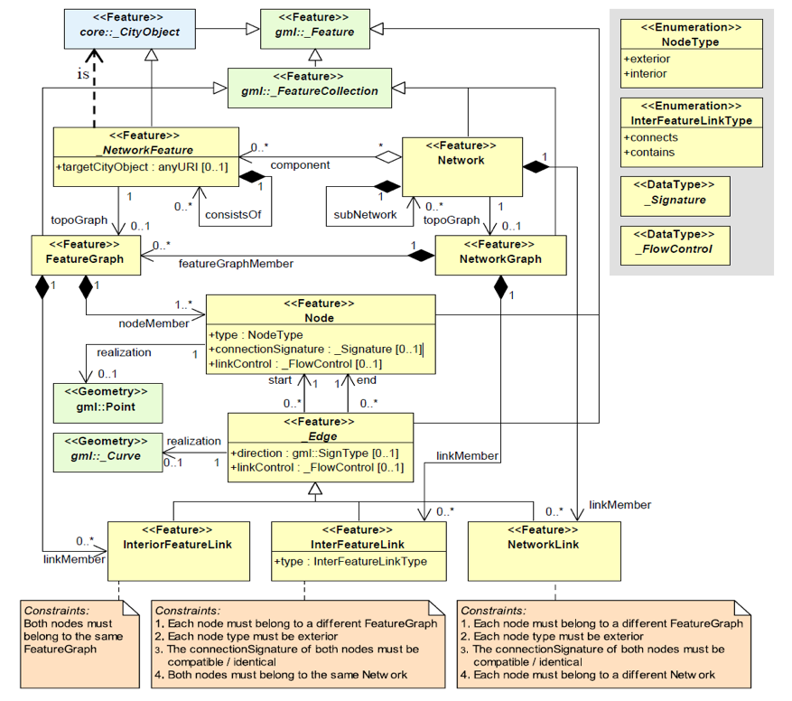
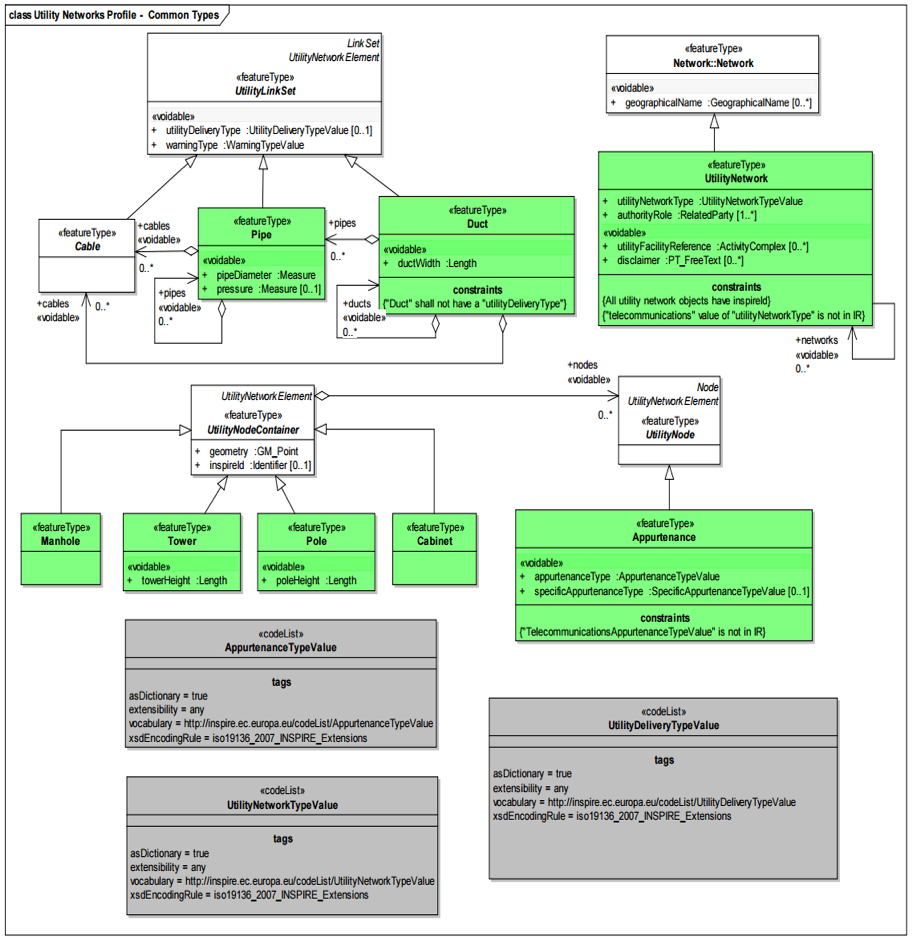
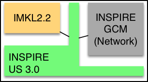
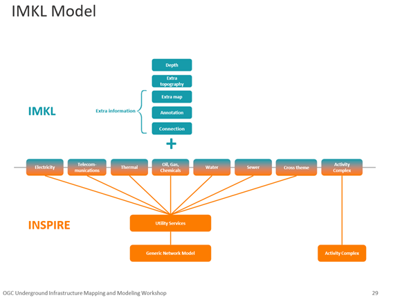
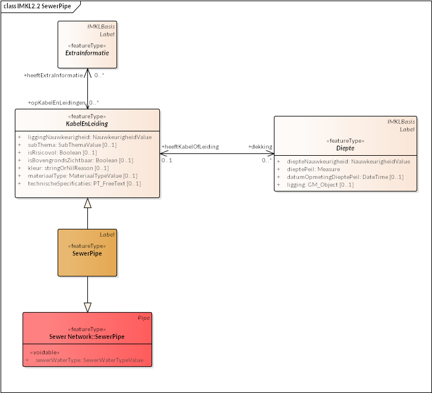
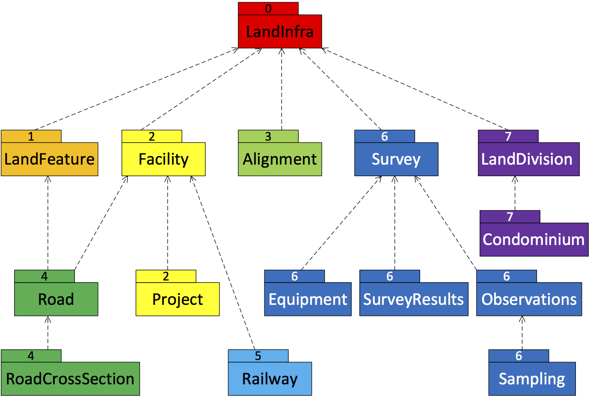

[[CandidateModels]]
== Candidate Underground Information Models

=== Overview
The UICDS contribution from Sisi Zlatanova and Ben Gorte (Delft University of Technology, Netherlands) listed a number of design criteria for UGII models which help explain the diversity of existing models which are presently in development or use.

[[DesignCriteria]]
.UGII model design criteria
  . Different applications and user roles require different information. For example, some stakeholders need the location of the utilities, while others need the details like the type of transported material.
  . Types of objects and their properties to be represented.
  . Object naming conventions to be observed.
  . Complexity of object representation, e.g. 2D point or 3D solid geometry.
  . Aggregation and generalization of objects and object details. For example a collector with cables can be modeled by many objects or by one object with a property of number of cables.
  . Relations represented between distinct networks.
  . Relations represented to other underground or above-ground features.
  . Operations and other processing to be performed on the data.
  . System architecture of implementing systems, e.g. distributed storage or a centralized system.
  . Visualisation requirements (2D/3D, web, specialized software)
  . Size, scope, and update frequency of the represented infrastructure area.
  . Granularity and flexibility of data query and access.

Existing models identified in the UICDS can be divided into those covering generic utility infrastructure, specific utility networks, underground geology / hydrology, land infrastructure, and practices of surveying and measuring underground features.

[[UtilityTypes]]
.Significant utility network types
 * Electricity network
 * Oil, Gas & Chemicals network
 * Sewer network
 * Telecommunications network
 * Thermal network
 * Water network
 * Transport network

[[CommonAttributes]]
.Common feature attributes
 * Location – e.g., XY coordinate and/or Z-depth
 * Shape – e.g., a rectangle or round pipe
 * Color
 * Diameter – e.g., exterior/interior diameter
 * Material – e.g., rubber, steel, iron, etc.
 * Ownership
 * Date (Installation and Last update)

=== Candidate infrastructure models and characteristics

. *CityGML Utility Network ADE (Application Domain Extension)* <<NR-CityGML-UN-ADE,[1]>> leverages CityGML by representing supply and disposal networks in 3D city models. CityGML is an OGC data model and XML-based format for the storage and exchange of virtual 3D city models. As a CityGML extension, the Utility Network ADE directly supports 3D topographic, topological and functional modeling of hierarchies; it can thus provide homogenized and integrated views of multi-utility networks together with other CityObjects. It would likely require specialized CityGML software systems, however, to leverage more advanced UN ADE characteristics such as network vs feature graphs or functional network roles.
+
[#img_cityGML,reftext='{figure-caption} {counter:figure-num}']
.CityGML Utility Network ADE Data Model

+
. *INSPIRE Utility Networks* <<NR-INSPIRE-UN,[2]>> is one of the 34 INSPIRE spatial data themes. INSPIRE is a European Union initiative to establish an infrastructures for spatial information that is geared to help to make spatial or geographical information more accessible and interoperable for a wide range of purposes supporting sustainable development. The theme _Utility and Government Services_ provides basic information (e.g. the location, basic technical characteristics or involved parties) on a wide range of administrative and social services of public interest.
Subtheme (INSPIRE, 2013)::
* _Utility Networks_: Node-link-node structured networks for collection, transmission and distribution, including electricity, oil/gas and chemicals, sewer, thermal, water or (not mandatory) telecommunications networks;
+
General service information::
+
 * Feature location;
 * Party involved in the service (Administration or organization on behalf of an administrative mandate);
 * Basic technical characteristics, such as capacity or details on the type of service provided.
+
Utilities considered::
 * Electricity network,
 * Oil, Gas & Chemicals network,
 * Sewer network,
 * Thermal network,
 * Water network,
 * Telecommunications network (only proposed in the technical guidance, not in legislation).
+
[#img_inspireUtilities,reftext='{figure-caption} {counter:figure-num}']
.INSPIRE utilities network common types model

+
. *IMKL (Information model for cable and pipes)* <<NR-IMKL,[3]>> is an INSPIRE-based specification for the exchange of cable and pipe information. As mentioned in UICDS contribution from Sisi Zlatanova and Ben Gorte of Delft University of Technology, Netherlands, IMKL has been developed by the Dutch Cadastre and further refined by Informatie Vlaanderen. It extends the INSPIRE Utility Services model as illustrated in Figure 3.
+
[#img_IMKL,reftext='{figure-caption} {counter:figure-num}']
.Flanders refinement of IMKL data model

+
The UICDS contribution from Jef Daems of Informatie Vlaanderen highlights the adoption of IMKL in the KLIP system which facilitates the sharing of underground information from network operators in the Flanders region of Belgium in order to service excavation requests. The version of IMKL used in KLIP is based on the initial Dutch model and has evolved to meet the practical needs of excavators and the utility sector in Flanders. Essentially IMKL further specializes the specific utility network types defined in the INSPIRE theme model by inheriting additional properties from IMKL types such as Depth or ExtraTopography (Figure 4). This multiple inheritance pattern adding the IMKL Kabelenleiding (CableConduit) properties to the INSPIRE SewerPipe object is shown in Figure 5.
+
[#img_imklModel,reftext='{figure-caption} {counter:figure-num}']
.IMKL data model

+
[#img_imklSewerPipe,reftext='{figure-caption} {counter:figure-num}']
.IMKL multiple object inheritance pattern

+
. *ESRI Utility Network Model* <<NR-ESRI-UN,[3]>> represents a number of models constructed as geodatabases that leverage ArcGIS geometric networks to represent the connections between utility objects specialized for particular utilities, including

 * Utility and Pipeline Data Model
 * Fiber Network Data Model
 * Gas, Water, Electric, and Wireline Cable models

These models contain large numbers of features specialized for particular industries, but the geometric network construction can restrict which forms and dimensions of connectivity can easily be represented in the model.
+

=== Candidate models and characteristics for specific utilities

The models described here are intended to represent data for particular utility industries. They are potential sources of data objects, properties, and codelists for UGI pertaining to those utilities. Information from datasets conforming to these models may also need to be mapped into an integration model. They themselves are not, however, candidates for cross-utility integration models.

. *Power Utilities* – IEC (International Electrotechnical Commission) CIM (Common Information Model) <<NR-CIM,[5]>> is a global standard for electric power transmission and distribution. The CIM is currently maintained as a UML model. It defines a common vocabulary and basic ontology for aspects of the electric power industry. The standards are listed below:
* IEC 62357 specifies a reference Service Oriented Architecture (SOA) and framework for the development and application of IEC standards for the exchange of power system information in distribution, transmission, and generation systems involved in electric utility operations and planning. The multi-layer reference architecture considers new concepts and evolving technologies, such as semantic modeling and canonical data models, in order to build on technology trends of other industries and standards activities to achieve the interoperability goals of the Smart Grid.
* IEC 61970 defines an application programming interface for energy management including a Common Information Model (CIM) that defines the standard for data models in electrical networks and energy management. It supports the import and export of formats such as XDF, RDF and SVG, which are based on the XML standard
* IEC 61850 defines a standard for the design of electrical substation automation. The standard defines standard data models that allows for the mapping of various communications protocols.
* IEC 61968 defines a Common Information Model (CIM) for distribution management systems and builds on the benefits provided by 61970 in Transmission.
* IEC 62351 defines handling of security of protocols including authentication of data transfer to ensure authenticated access and detection of intrusion.
* IEC 62056 defines a set of standards for meter reading including data exchange for meter reading, and tariff and load control. The specification is not unique to electric meters and has been adopted for other industries including water and gas meters.
* IEC 61508 specifies the functional safety of electrical/electronic/programmable electronic safety-related systems.

+
. *Enterprise Systems for Utilities* – The MultiSpeak specification <<NR-MultiSpeak,[6]>> is a North American standard for data exchange between enterprise systems which commonly applied in utilities. It started in at the beginning of this century as a collaborative effort between NRECA (National Rural Electric Cooperative Association in the United States) and a small group of vendors supplying software to U.S. electric cooperatives.  The current version of the standard covers: Distribution System Modeling, Work Management, Business Functional External to Distribution Management, Distribution Operations, and Distribution Engineering, Planning Construction and GIS. MultiSpeak has its origins in serving the small utility and electric cooperative markets and is currently in use in the daily operations of more than 600 electric cooperatives, investor-owned utilities, municipals, and public power districts in the US and around the world.
+
[#img_multiSpeak,reftext='{figure-caption} {counter:figure-num}']
.MultiSpeak Process Model Overview
image::images/6-MultiSpeak.png[]
+
. *Wastewater Pipeline & Manhole Condition Assessment* – Condition inspection, assessment and monitoring of buried water and wastewater assets using both destructive and non-destructive trenching and trenchless technologies are well advanced in the water industry. The industry is organized around well-established national and international standards and guidelines for the assessment of the condition and performance of sewer and water pipes and there is a mature ecosystem of specialist wastewater and water contractors who carry out these inspections, hardware technology firms who provide the specialist equipment and appropriately trained staff to carry out these inspections, and software vendors who provide data management, GIS, decision support, capital planning, maintenance prioritization/scheduling systems etc. that leverage the results of the condition inspections for asset management purposes.  National standards for wastewater pipeline and manhole condition assessment have been adopted around the world – principally European Union (EU EN13505-2:2000), PACP/LACP (USA NASSCO), MACP (USA NASSCO), MSCC SRM4/5 (WRc. UK), WSSA (Australian), and other European Country specific standards (for example ISYBAU in Germany and Belgium). Each coding standard has its own condition scoring algorithm that is used to convert defect code observations into scores and indexes that are ultimately used to update a pipe’s structural and maintenance/service condition grade.
+
. *Gas Distribution* – The Gas Technology Institute has recently completed version 1.0 of their Gas Distribution Model (GDM). This standard serves three purposes: (i) data exchange between operators and vendor software; (ii) managing transmission and distribution data to facilitate vertical data integration; and (iii) the primary data model for operators.
+
. *Water/Wastewater Modeling* – US Environmental Protection Agency models – the Stormwater Management Model (SWMM) for storm and sanitary sewers and EPANET for water distribution systems, have become a de facto standard. However, they tend to only contain data needed for the simplest modeling applications; these models can only describe one scenario.

=== Underground environment candidate models

.Significant underground environment entities
 *    Soil units
 *    Bedrock units
 *    Groundwater units
 *    Geological structures / cavities
 *    Fill / debris
 *    Abandoned structures & artifacts
 *    Roots / burrows

 . *GeoSciML*
+
Used for geological map data, boreholes, and structural features such as faults and folds. http://www.opengeospatial.org/standards/geosciml[GeoSciML] is the model/exchange format leveraged by INSPIRE for its https://inspire.ec.europa.eu/Themes/128/2892[Data Specification on Geology]
+
. *INSPIRE*
+
http://inspire.ec.europa.eu/id/document/tg/ge[Data Specification on Geology]
uses and extends GeoSciML to cover a range of geologic thematic features
+
  . *GeoTOP*
+
https://www.tno.nl/en/focus-areas/energy/geological-survey-of-the-netherlands/geological-survey-of-the-netherlands/geotop/[GeoTOP] is a detailed three-dimensional model of the upper 30 to 50 meters of the subsurface produced by the Netherlands Organization for Applied Scientific Research (TNO). It provides the user with a cell-based description of the spatial variability of geological, physical, and chemical parameters in the subsurface.
+
. *BGS*
National Geological Model – UK 3D NGM
+
As part of the EU funded EarthServer project, the British Geologic Survey implemented geological surfaces as GML coverages, and uses GeoSciML to describe the rock bodies in relation to their bounding surfaces, with the GeoSciML being added to the extension metadata of the surface coverages.

=== Other infrastructure candidate models

.Other infrastructure features
 *   Foundation assemblies
 *   Vaults / conduits
 *   Transport tunnels / tracks / stations
 *   Underground storage

 . *Industry Foundation Classes* <<NR-IFC,[4]>> is the most widely used architecture and engineering standard for representing and exchanging data about buildings and their components. IFC represents logical building structures and their accompanying properties (attributes) along with 2D and 3D geometry. IFC can also represent utilities components as building services, but generally focuses on buildings themselves rather than general city infrastructure.
+

+
 . *Land and Infrastructure Conceptual Model (LandInfra)* <<NR-LandInfra,[5]>> is an OGC standard for division of land. The standard includes support for topography as well as subsurface information. It also provisions support for information about civil engineered facilities such as roads and railways, and in the future, “wet” infrastructure including storm drainage, wastewater, and water distribution systems. LandInfra is divided into 15 Requirements Classes for particular subject areas. LandInfra does overlap onto many underground infrastructure elements but it's focus is on the land divisions that may be implied by infrastructure components such as water systems, rather than the components themselves.
+
[#img_landInfra,reftext='{figure-caption} {counter:figure-num}']
.Current LandInfra requirement classes and corresponding InfraGML packages (minus prospective utility network classes)

