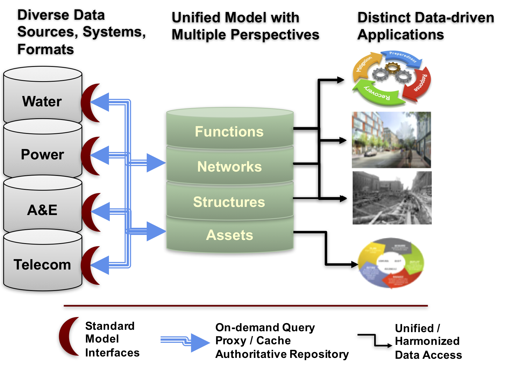
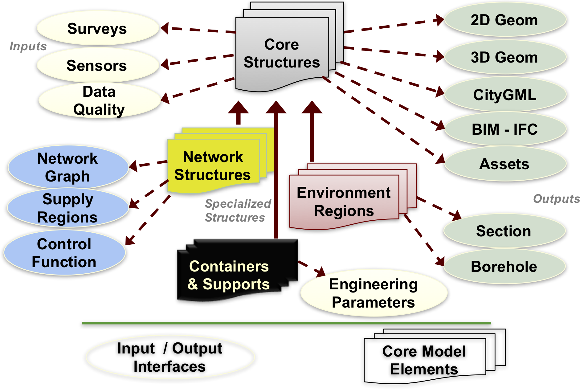
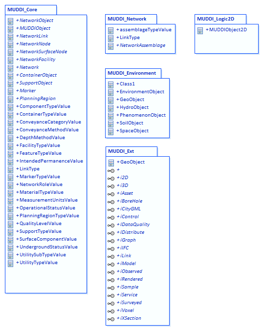

[[CoreOverview]]
== MUDDI Overview and Core

=== System context
As described in earlier sections of this report, the MUDDI model is intended to serve as a basis for integrating underground data from multiple sources, systems, and schemas. Datasets may be virtually integrated, so that each dataset is accessed remotely in the form of MUDDI data, or physically integrated and stored as MUDDI data in one system, either as a performance-enhancing cache, or as a tested and authoritative repository. With either system approach, the model requires multiple input interfaces that enable datasets to be mapped into the model from diverse sources, and multiple output interfaces that provide access to the right perspectives for each of several data-driven applications.

[#img_integrationArchitecture,reftext='{figure-caption} {counter:figure-num}']
.Integration architecture for MUDDI

=== MUDDI model architecture
The MUDDI model consists of a small number of core entities derived from a general feature object, including network features, support and container features, and underground environment features. The core entities are further specialized for specific utility network types with both additional attributes and utility-specific type codes.

These core feature entities are then enhanced as needed by realizing one or more interfaces that support specific types of input data, transformations to/from significant external model schemas, additional geometry types such as 2D, 3D, and voxel, network connectivity and functionality, data quality measures, and so on that are further described in Section 7.

[#img_modelStructure,reftext='{figure-caption} {counter:figure-num}']
.MUDDI

=== MUDDI core model elements
The MUDDI model packages are shown in Figure 10 and comprises a core package, network package, environment package, and package of extended interfaces. An additional package is an example of a logical model specialization of the conceptual model. The core MUDDI classes are shown in Figure 11. The root class of the model is MUDDIObject, whose attributes include many of those recommended for infrastructure assets in the ASCE As-Built draft specification

A child network object feature includes most of the other attributed specified by the ASCI As-Built is specialized by three network elements: a network node, a network surface node, and a network link. The basic network also includes network and network facility objects as well as simple optional relationships between them.

Two other MUDDIObject children are the container and support object features, for built structures which do not constitute directly either network infrastructure or environmental elements, but contain or support other infrastructure elements.

A significant update to the version 1.0 model is inclusion of a number of codelists shown in Figure 12 that provide both controlled and authoritative values for many of the attributes for the core MUDDI features.

[#img_modelCore,reftext='{figure-caption} {counter:figure-num}']
.MUDDI packages

[#img_modelCore,reftext='{figure-caption} {counter:figure-num}']
.MUDDI core features
image::images/7-model_core_features.png[]

[#img_modelCore,reftext='{figure-caption} {counter:figure-num}']
.MUDDI code lists
image::images/7-model_codelists.png[]

=== MUDDI environment entities and relationships
Another MUDDIObject specialization shown in Figure 13 is the Environment Object feature, further specialized into features representing geological, hydrological, pedological (soil-specific), and phenomenological features of the subsurface environment. The general geometry type for these features will be a region bounded by surfaces, but interfaces add both cross-sections and borehole geometries as input and/or output capabilities.

[#img_modelCore,reftext='{figure-caption} {counter:figure-num}']
.MUDDI environment features
image::images/7-model_environment_features.png[]

=== MUDDI network entities and relationships
The combination of MUDDI network features and network-specific interfaces need only describe collections of network infrastructure elements, but may optionally support a number of distinct levels of network representation complexity, as well as levels of detail. Figure 11 hides the inheritance relations between the different network entities in order to focus on the relationships that can be represented between them. The IGraph interface adds these specific relationships. For example, networks can be related to each other as either subnetworks (containment) or subordinate networks (dependency). Networks consist of nodes and links, which in turn connect to each other. Relative to a particular network, however, either a node or a link may in addition serve as an interfacial element, belonging to more than one network or connecting to an element of another network.

A capability supported by CityGML UN ADE is the option to represent inter-network assemblages ("internal" relationship) which depict additional graph detail inside of what is represented as either a node or a link at a lower level of detail. This generally requires interfacial relations to describe the connection between the internal network and elements of the enclosing network

[#img_modelCore,reftext='{figure-caption} {counter:figure-num}']
.MUDDI network features and relations
image::images/7-model_network.png[]

The MUDDI interfaces package comprises some 19 different interfaces that add geometric attributes, additional network relations, transformations to other model perspectives, and other capabilities to any parent or child object without the requirement for them to be carried along to further specializations.

[#img_networkRelations,reftext='{figure-caption} {counter:figure-num}']
.MUDDI extended interfaces
image::images/7-model_interfaces.png[]
