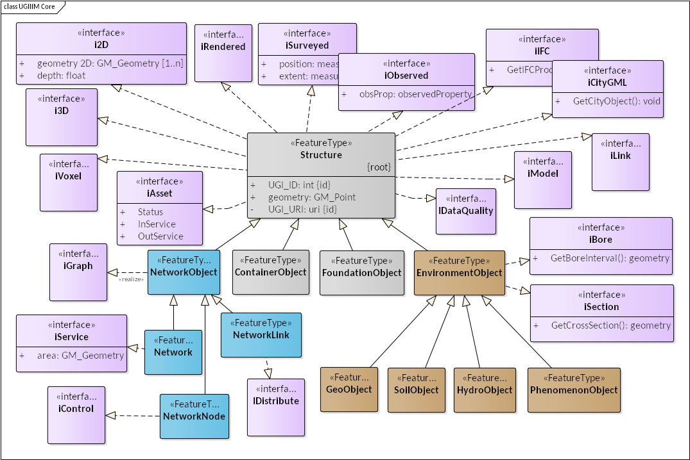
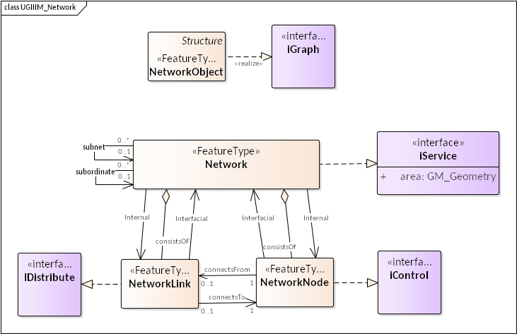

[[CoreOverview]]
== MUDDI Overview and Core

=== System context
As described in earlier sections of this report, the MUDDI model is intended to serve as a basis for integrating underground data from multiple sources, systems, and schemas. Datasets may be virtually integrated, so that each dataset is accessed remotely in the form of MUDDI data, or physically integrated and stored as MUDDI data in one system, either as a performance-enhancing cache, or as a tested and authoritative repository. With either system approach, the model requires multiple input interfaces that enable datasets to be mapped into the model from diverse sources, and multiple output interfaces that provide access to the right perspectives for each of several data-driven applications.

[#img_integrationArchitecture,reftext='{figure-caption} {counter:figure-num}']
.Integration architecture for MUDDI
image::images/7-integration_architecture.png[]

=== MUDDI model architecture
The MUDDI model consists of a small number of core entities derived from a general structure feature, including network features, support and container features, and underground environment features. The core entities are further specialized for specific utility network types with both additional attributes and utility-specific type codes.

These core feature entities are then enhanced as needed by realizing one or more interfaces that support specific types of input data, transformations to/from significant external model schemas, additional geometry types such as 2D, 3D, and voxel, network connectivity and functionality, data quality measures, and so on that are further described in Section 7.

[#img_modelStructure,reftext='{figure-caption} {counter:figure-num}']
.MUDDI
image::images/7-model_structure.png[]

=== MUDDI core model elements
The full core model (not including utility-specific specializations) is shown in Figure 10. The core MUDDI feature is extended by 12 optional interfaces which add attributes and/or operations to the core class. A child network object feature is specialized by three network elements: a network itself, a network node, and a network link. The basic network serves as a container for other network elements. The IGraph interface provides topological elements and relations which permit networks to represent the connectivity structure among links and nodes.

Another structure feature child is the Environment Object feature, further specialized into features representing geological, hydrological, pedological (soil-specific), and phenomenological features of the subsurface environment. The general geometry type for these features will be a region bounded by surfaces, but interfaces add both cross-sections and borehole geometries as input and/or output capabilities.

Two other structure feature children are the container and support object features, for built structures which do not constitute directly either network infrastructure or environmental elements, but contain or support other infrastructure elements.

[#img_modelCore,reftext='{figure-caption} {counter:figure-num}']
.MUDDI core elements

=== MUDDI network entities and relationships
The combination of MUDDI network features and network-specific interfaces need only describe collections of network infrastructure elements, but may optionally support a number of distinct levels of network representation complexity, as well as levels of detail. Figure 11 hides the inheritance relations between the different network entities in order to focus on the relationships that can be represented between them. The IGraph interface adds these specific relationships. For example, networks can be related to each other as either subnetworks (containment) or subordinate networks (dependency). Networks consist of nodes and links, which in turn connect to each other. Relative to a particular network, however, either a node or a link may in addition serve as an interfacial element, belonging to more than one network or connecting to an element of another network.

A capability supported by CityGML UN ADE is the option to represent internal networks ("internal" relationship) which depict additional graph detail inside of what is represented as either a node or a link at a lower level of detail. This generally requires interfacial relations to describe the connection between the internal network and elements of the enclosing network

Conversely, the IService interface adds a generalization to represent homogeneous the geographic area that may be served by a particular network or network segment in order to identify vulnerable customers even if all of the network house connections are not represented.

Additional IControl and IDistribute interfaces add network roles and functionality for both operations and simulation modeling purposes, which may be combined with additional model parameters via the IModel interface.

[#img_networkRelations,reftext='{figure-caption} {counter:figure-num}']
.MUDDI network entities and relationships

